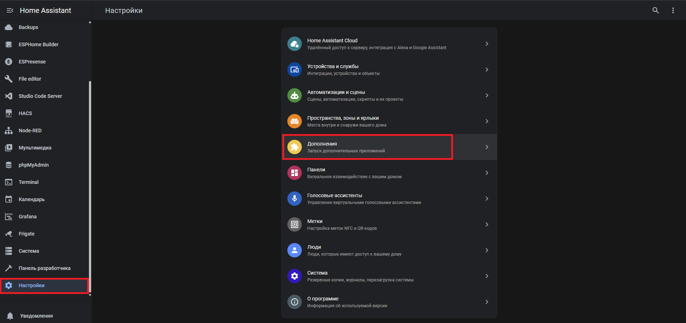
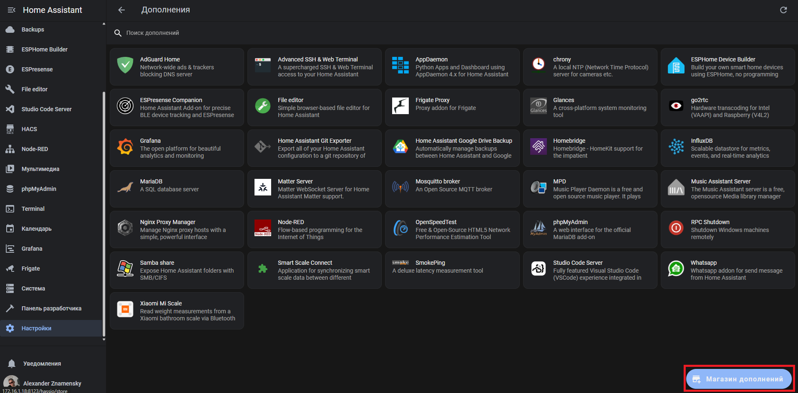
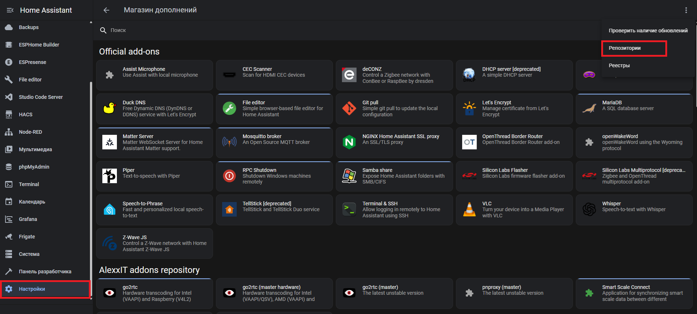
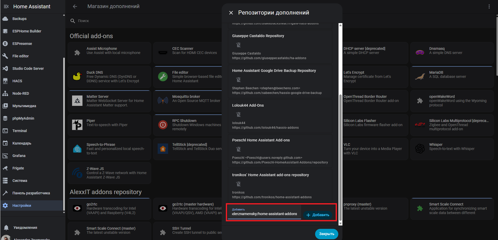
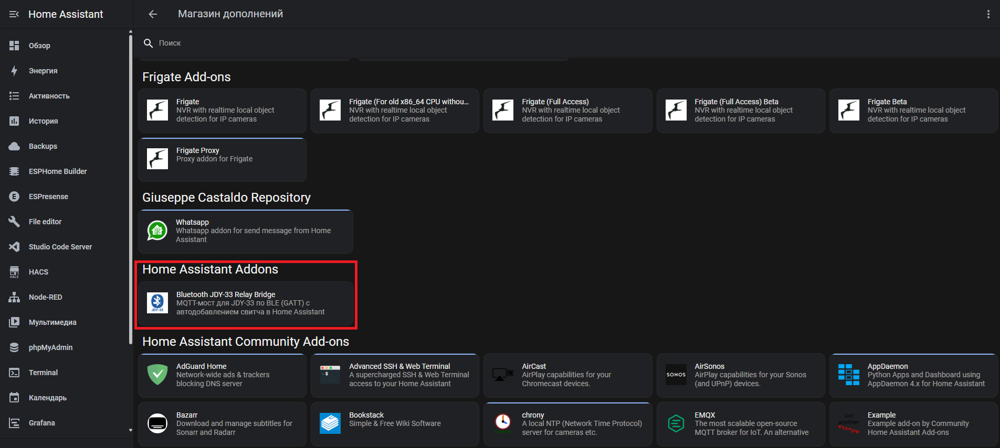
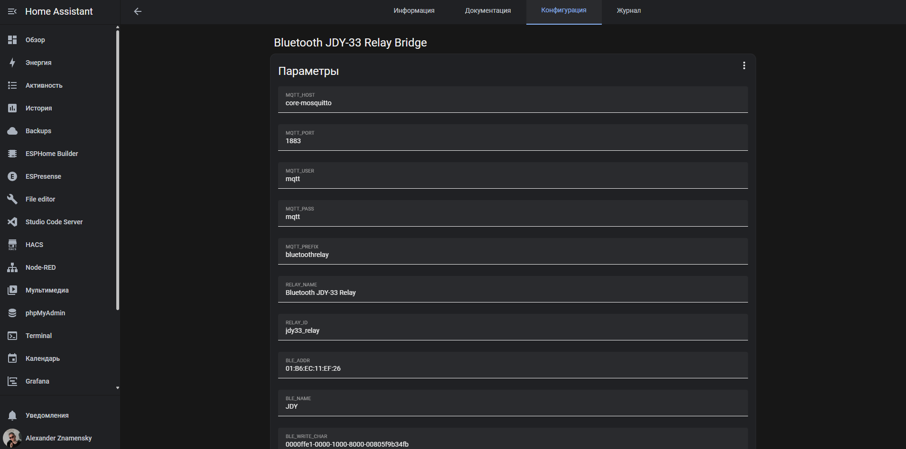

# Home Assistant addons

- [Bluetooth-JDY-33-Relay-Bridge](https://github.com/alexanderznamensky/Bluetooth-JDY-33-Relay-Bridge) - MQTT-мост для Bluetooth-модулей JDY-33-BLE

## Install

You must using [Home Assistant](https://www.home-assistant.io/) version with addon support.

[Home Assistant Operating System](https://www.home-assistant.io/installation/#about-installation-types) is the recommended installation type.

Note: Supervised installation type is deprecated and will no longer be supported after the release of Home Assistant 2025.12.

**Add addon repository**

`https://github.com/alexanderznamensky/home-assistant-addons`

**Install addon**

**Config addon**

